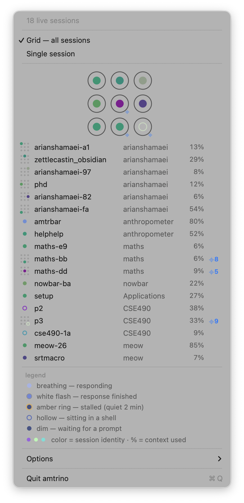
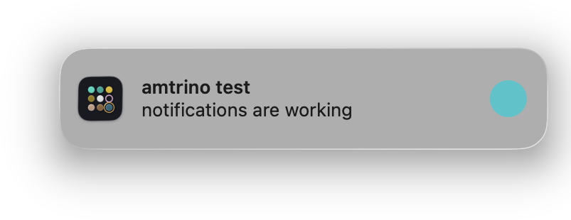
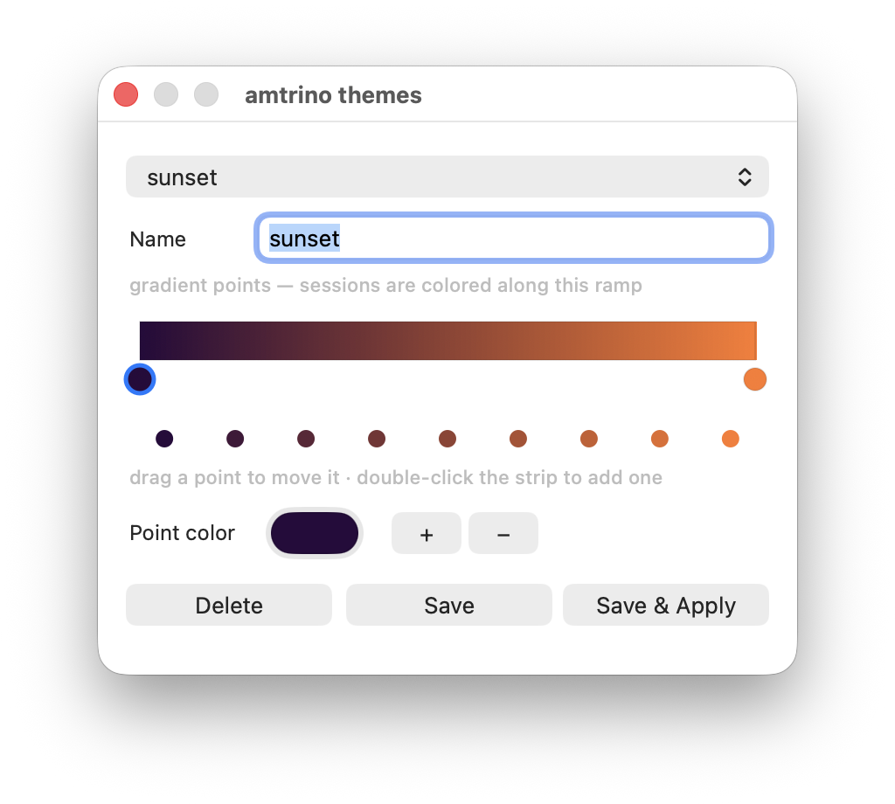

# amtrino &nbsp;·&nbsp; menu bar

**Every AI coding session on your Mac, at a glance — one breathing dot each.**


<sub>↑ the actual menu bar icon, recorded from the app's own render hook: nine live sessions, the bright ones mid-response, breathing.</sub>

> **amtrino watched itself being born.** It was built in one long
> [Claude Code](https://claude.com/claude-code) session inside
> [anthropometer](https://github.com/arian-shamaei/anthropometer) — and for
> most of that day, the session building it was dot #6 in its own grid,
> pulsing while it implemented the pulse.

[](https://github.com/arian-shamaei/amtrino/releases)
&nbsp;·&nbsp; [](LICENSE)
&nbsp;·&nbsp; [](https://github.com/arian-shamaei/anthropometer#ai-usage)
&nbsp;·&nbsp; Swift/AppKit · notarized · macOS 13+ · Claude Code + Codex CLI

---

## Why

You run five, ten, eighteen agent sessions at once — and the only way to
know which ones finished, stalled, or filled their context is to cycle
through terminal panes. amtrino puts the whole fleet in the menu bar:
**color = which session, motion = what it's doing, click = go there.**

## The menu



Every session as a row (name · project · context %), and the 3×3 node grid
that **is** the bar icon: drag any session onto a node to pin it to that
exact spot, click an occupied node to leave a deliberate gap, click a row
to hide it. Every session row carries its own submenu (▸) with two more
verbs: jump to its terminal, or end the session (a confirmed, graceful
SIGTERM to the agent process). The legend at the bottom animates — the
"breathing" sample actually breathes.

## Finished responses find you



When a session stops responding, its dot flashes white — and optionally a
notification fires, carrying the session's identity dot. **Click the
banner and amtrino jumps you to that session's exact tmux pane**, in
whatever terminal hosts it (found generically by process ancestry — no
per-terminal integration).

The finish sound is a custom soft chime — a kalimba fifth synthesized by
[`scripts/make-sounds.py`](scripts/make-sounds.py) — with three soothing
choices (plus system default and silent) under Options ▸ Notification
sound, previewed as you pick.

## Themes are gradients you can edit



Eight built-ins (identity, pastel, monochrome, pressure zones, vaporwave,
matrix, ember, candy) plus your own: a multi-stop gradient editor —
double-click the strip to add a color point, drag points to move them.
Sessions land at stable positions along the ramp, so they stay
tellable-apart under any theme. Identity mode adapts its sampling to the
menu bar's light/dark appearance, per surface.

When the [amtr](https://github.com/arian-shamaei/anthropometer) TUI is
attached to the same session, single-session tank mode mirrors amtr's
exact rolled palette, live — pinned by cross-language golden tests.

## Install

**Direct** (signed + notarized by Apple — no Gatekeeper friction):
download the zip from
[Releases](https://github.com/arian-shamaei/amtrino/releases), unzip, drop
`amtrino.app` into /Applications.

**Homebrew:**

```sh
brew tap arian-shamaei/anthropometer
brew install --cask amtrino
```

Requires macOS 13+ and `python3` (≥3.9, stdlib only) on PATH. Fully
standalone — the amtr TUI is not required. Uninstall: quit amtrino, delete
the app (or `brew uninstall --cask amtrino`); settings live in
`defaults delete dev.arian-shamaei.amtrino`.

## How it works

amtrino renders; it never owns data. A bundled copy of anthropometer's
`amtr_engine.py` (stdlib Python) runs in `--fleet` mode — a
change-detected JSON stream of every live session, read from the records
Claude Code and Codex CLI already write on disk. The wire contract is
anthropometer's `SPEC.md` §f2. Codex sessions pair live `codex` processes
with their newest cwd-matching rollout; status is event-precise
(`task_started`/`task_complete`).

First launch opens an animated, nearly wordless tour (Options ▸ Help
replays it). No accounts, no network calls, nothing leaves your machine —
the optional bug reporter just drafts an email.

## Build

```sh
swift build                       # dev build
.build/debug/AmtrBar --selfcheck  # palette goldens, wire model, slot law
sh scripts/build.sh 0.1.1         # assemble + sign + notarize amtrino.app
```

Signing auto-detects a Developer ID Application cert (hardened runtime)
and notarizes + staples when a `notarytool` keychain profile named
`amtrino` exists; otherwise ad-hoc for local dev. README assets are
captured from the real app (`AMTRINO_DUMP` renders exact icon frames —
see `scripts/shots.sh`).

## License

[MIT](LICENSE) © Arian Shamaei
